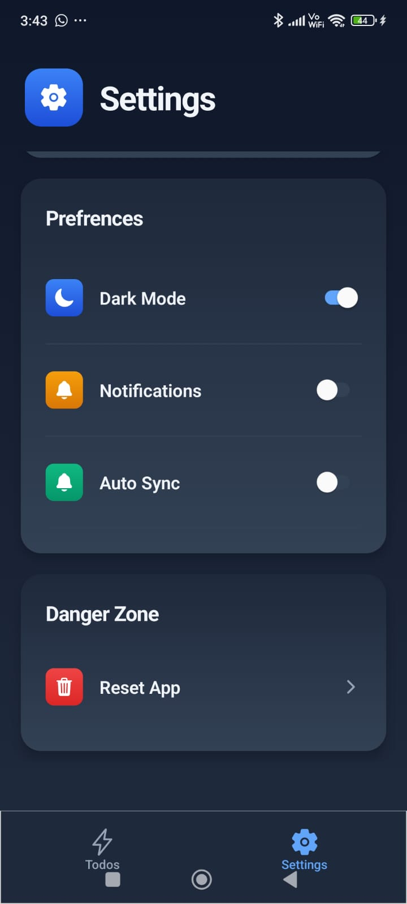
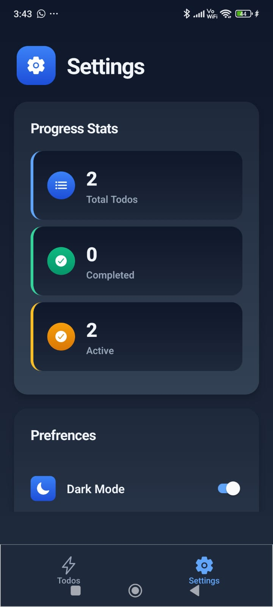
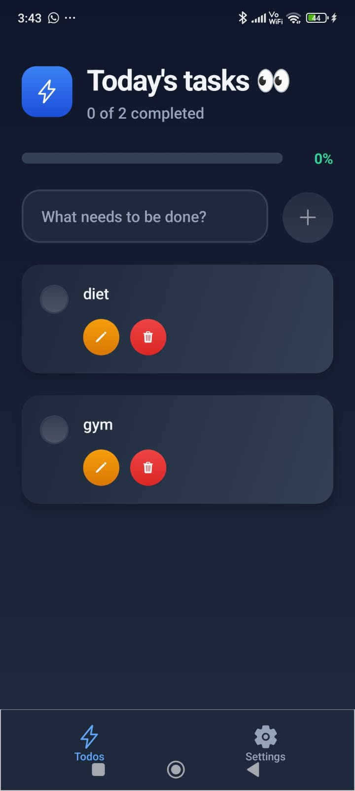
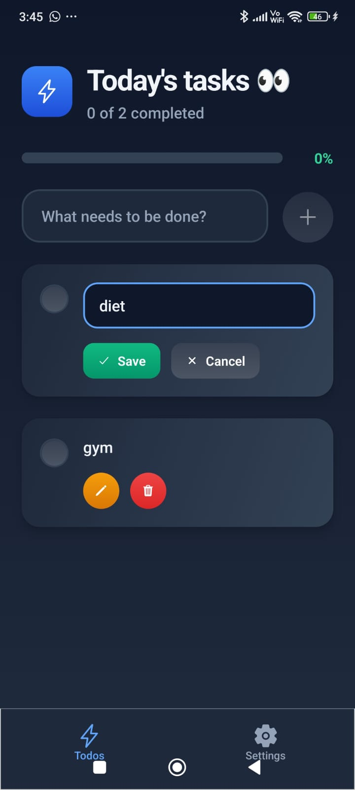

# 📱 React Native Todo App with Real-Time Sync

A modern, feature-rich todo application built with React Native, Expo, and Convex that demonstrates real-time data synchronization across all devices. This project showcases professional mobile development practices with a powerful backend integration.

<div align="center">
  
  
  
  
</div>

<!-- Replace with your actual screenshots -->

## ✨ Key Features

### 🎯 Core Functionality

- ➕ **Add Tasks**: Create new todos with intuitive input
- ✅ **Toggle Completion**: One-tap completion status updates
- 📝 **Edit Tasks**: Inline editing with smooth UX
- 🗑️ **Delete Tasks**: Swipe-to-delete or button removal
- 📊 **Progress Tracking**: Live progress bar with completion percentage

### 🔄 Real-Time Sync

- **Instant Updates**: Changes reflect immediately across all connected devices
- **Offline Support**: Works offline with automatic sync when reconnected
- **Cross-Platform**: Seamless experience on iOS, Android, and web

### 🎨 User Experience

- 🌙 **Dark/Light Mode**: System-aware theme switching
- 🏗️ **Modern UI**: Clean, minimalist design with smooth animations
- 📱 **Responsive**: Optimized for all screen sizes
- 🔔 **Smart Notifications**: Contextual feedback and alerts

### ⚙️ Advanced Settings

- 📈 **Task Statistics**: Comprehensive overview of your productivity
- 🔄 **Sync Preferences**: Control over automatic synchronization
- 🚨 **Data Management**: Safe bulk operations with confirmations

## 🏗️ Technical Architecture

### 🛠️ Tech Stack Choices

**Frontend: React Native + Expo**

- _Why Expo?_ Rapid development, easy testing across platforms, and excellent developer experience without complex native setup
- _Why React Native?_ Single codebase for iOS/Android with near-native performance and extensive ecosystem

**Backend: Convex**

- _Why Convex?_ Real-time capabilities out of the box, TypeScript-first approach, and simplified backend development
- _Benefits_: Automatic API generation, live queries, and robust real-time synchronization

**Navigation: React Navigation v6**

- _Why this choice?_ Most mature navigation solution for React Native with excellent TypeScript support
- _Structure_: Tab navigator for main sections, stack navigator for detailed flows

**State Management: React Hooks + Convex Queries**

- _Philosophy_: Leverage Convex's built-in state management for server state, React hooks for local UI state
- _Benefits_: Reduced complexity, automatic caching, and optimistic updates

## 🚀 Getting Started

### Prerequisites

Before you begin, ensure you have:

- **Node.js** v16 or higher ([Download](https://nodejs.org/))
- **npm** or **yarn** package manager
- **Expo CLI** globally installed: `npm install -g @expo/cli`
- **Convex Account** ([Sign up free](https://convex.dev/))

### 📋 Environment Setup

1. **Clone the repository:**

   ```bash
   git clone https://github.com/yourusername/react-native-todo-app.git
   cd react-native-todo-app
   ```

2. **Install dependencies:**

   ```bash
   npm install
   # or
   yarn install
   ```

3. **Set up Convex backend:**

   ```bash
   npx convex dev
   ```

   Follow the prompts to create a new Convex project.

4. **Configure environment variables:**

   Create a `.env` file in the project root:

   ```env
   CONVEX_DEPLOYMENT=your-deployment-name
   EXPO_PUBLIC_CONVEX_URL=https://your-deployment.convex.cloud
   ```

   > 💡 **Tip**: Get these values from your Convex dashboard after project setup.

### 🏃‍♂️ Running the Application

1. **Start the Convex development server:**

   ```bash
   npx convex dev
   ```

   Keep this terminal open - it handles real-time backend updates.

2. **Start the Expo development server:**

   ```bash
   npx expo start
   ```

3. **Launch on your preferred platform:**
   - **iOS**: Press `i` or scan QR with Camera app
   - **Android**: Press `a` or scan QR with Expo Go
   - **Web**: Press `w` for browser version

> 🍎 **No Mac Required!** Test iOS using Expo Go on physical devices or Expo's cloud simulators.

## 📁 Project Structure

```
📦 react-native-todo-app/
├── 📄 .env                     # Environment variables
├── 📄 app.json                 # Expo configuration
├── 📄 convex.json              # Convex configuration
├── 📄 package.json             # Dependencies
├── 📁 src/
│   ├── 📁 components/          # Reusable UI components
│   │   ├── TodoItem.tsx
│   │   ├── ProgressBar.tsx
│   │   └── ThemeToggle.tsx
│   ├── 📁 screens/             # Main app screens
│   │   ├── TodosScreen.tsx
│   │   └── SettingsScreen.tsx
│   ├── 📁 navigation/          # Navigation setup
│   │   └── AppNavigator.tsx
│   ├── 📁 hooks/               # Custom React hooks
│   │   └── useTheme.tsx
│   ├── 📁 utils/               # Helper functions
│   │   └── constants.ts
│   └── 📁 types/               # TypeScript definitions
│       └── index.ts
├── 📁 convex/                  # Backend functions
│   ├── todos.ts                # Todo CRUD operations
│   ├── schema.ts               # Database schema
│   └── _generated/             # Auto-generated files
├── 📁 screenshots/             # App screenshots
└── 📄 README.md               # This file
```

## 🔧 Development Workflow

### 🧪 Testing Your Changes

1. **Hot Reload**: Changes automatically reflect in the app
2. **Convex Dashboard**: Monitor backend changes in real-time
3. **Cross-Platform**: Test on multiple devices simultaneously

### 🚀 Building for Production

```bash
# Build for iOS
npx expo build:ios

# Build for Android
npx expo build:android

# Deploy Convex backend
npx convex deploy
```

## 🎯 Key Learning Outcomes

This project demonstrates mastery of:

### 📱 **Mobile Development**

- Cross-platform app architecture
- Responsive design patterns
- Platform-specific optimizations
- Navigation patterns and UX flows

### ⚡ **Real-Time Features**

- Live data synchronization
- Optimistic UI updates
- Offline-first architecture
- Conflict resolution strategies

### 🏗️ **Modern React Patterns**

- Custom hooks for reusable logic
- Component composition
- TypeScript integration
- Performance optimization

### 🔄 **Backend Integration**

- Real-time database operations
- API design and consumption
- State management across client/server
- Error handling and resilience

## 🤝 Contributing

We welcome contributions! Here's how you can help:

1. **🐛 Report bugs** using GitHub issues
2. **💡 Suggest features** with detailed use cases
3. **🔧 Submit PRs** following our coding standards
4. **📚 Improve docs** to help other developers

### Development Guidelines

- Follow TypeScript best practices
- Write descriptive commit messages
- Add tests for new features
- Update documentation for API changes

## 🔧 Troubleshooting

### Common Issues

**Convex Connection Errors**

```bash
# Verify your .env file
cat .env

# Restart Convex dev server
npx convex dev --once
```

**Expo Build Issues**

```bash
# Clear Expo cache
npx expo start --clear

# Reset Metro cache
npx expo start --reset-cache
```

**Node Modules Issues**

```bash
# Clean install
rm -rf node_modules package-lock.json
npm install
```

## 📞 Support & Resources

- **📖 Expo Docs**: [docs.expo.dev](https://docs.expo.dev)
- **🔄 Convex Docs**: [docs.convex.dev](https://docs.convex.dev)
- **🧭 React Navigation**: [reactnavigation.org](https://reactnavigation.org)
- **🐛 Issues**: [GitHub Issues](https://github.com/yourusername/repo/issues)

## 📄 License

This project is licensed under the MIT License - see the [LICENSE](LICENSE) file for details.

## 🙏 Acknowledgments

- Expo team for the amazing development platform
- Convex team for the real-time backend solution
- React Native community for continuous innovation

---

**Made with ❤️ and React Native**
